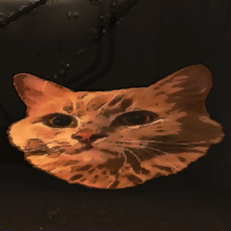

# ArachnophobiaMod

A Lethal Company mod that replaces spiders with cats (model and sounds).

---

Also changes the bestiary video and replaces spider noises with cat sounds.

The webs are still there, let me know on GitHub if you have suggestions.

The cat picture comes from the arachnophobia mode of [Satisfactory](https://satisfactory.wiki.gg/wiki/Stinger#Arachnophobia_Mode_On-0).

Sounds used :
 - "Little cat attention meow" and "Domestic cat hungry meow" by [Mixkit](https://mixkit.co/free-sound-effects/cat/) ([license](https://mixkit.co/license/#sfxFree))
 - "Cat, Screaming, A.wav" by [InspectorJ](https://www.jshaw.co.uk/), from [Freesound.org](https://freesound.org/people/InspectorJ/sounds/415209/)
 - "Angry cat Roo.wav" by secondbody, from [Freesound.org](https://freesound.org/people/secondbody/sounds/50357/)
